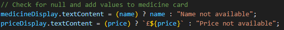
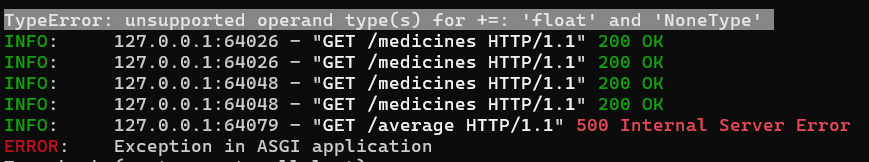

# Lilly Technical Challenge Documentation

## Approach
*How did you approach this challenge? Did you work through the objectives in any particular order? If so, why? Did you utilize any external resources, such as tutorials, guides, or other materials?*

- I started with ideation and design solution for the objectives given
- Then I started working on the HTML and CSS files first for reference and later started on JavaScript
- As I added functions on JavaScript I updated HTML and CSS files to suppport the changes
- I choose this order and method because it allowed me to have a solid idea of what I wanted the website to look like while giving me flexibility to change/update features as I coded
- I used a variety of resources from stack overflow, youtube tutorials, google search and AI tools

## Objectives - Innovative Solutions
*For the challenge objectives, did you do anything in a particular way that you want to discuss? Is there anything you're particularly proud of that you want to highlight? Did you attempt some objectives multiple times, or go back and re-write particular sections of code? If so, why? Use this space to document any key points you'd like to tell us about.*

- For the challenge objective I studied the code already provided and used parts of it to replicate how the GET method should be structured. Afterwards I just implemented a few lines of code to perform calculation based on the array fetched
- I am particularly proud of the layout of the website as I tried to use user experience concepts as a guide for a modern-looking website (visibility, cosistency, feedback, affordance).
- Because the objectives were quite open-ended to display in a user-friendly way, I made changes to the HTML and CSS files as I coded, trying to achieve a well-structured outcome
- I had to adjust with new lines of code and change to existing ones on the JavaScript file as I went through, so for example, if I had an error that had not been addressed on JS I had to go back to make sure it was correctly handled

## Problems Faced
*Use this space to document and discuss any issues you faced while undertaking this challenge and how you solved them. We recommend doing this proactively as you experience and resolve the issues - make sure you don't forget! (Screenshots are helpful, though not required)*.

- data.json has medicine names as "Elixirium" which didn't allow for case sensitive error handling without having to change the whole JSON file
- Writing new medicine data to the data.json file as FormData was required. Resolved by going into main.py file and understading the code 
- Faced problems when iterating through medicines after all medicines were fetched and encountered null value for price. Added a ternary condition operator to check if variable contains a value before displaying   

- For problems relating to fetching data I used the console.log() and Postman to check if the data was being fetched correctly so I could find the problem
- I had problems while testing the GET average function that I created on main.py. Null value on price was crashing the fetch request, so I used Python virtual environment to understand and fix the code.    

## Evaluation
*How did you feel about the challenge overall? Did some parts go better than others? Did you run out of time? If you were to do this again, and were given more time, what would you do differently?*

- Overall, I felt satisfied with the result. I worked well within the knolwedge I had while seeking to learn the new concepts where there was a gap in my knowledge
- With this challenge, I have improved my self-learning skills, which I believe is one of the keys to success in the technology industry